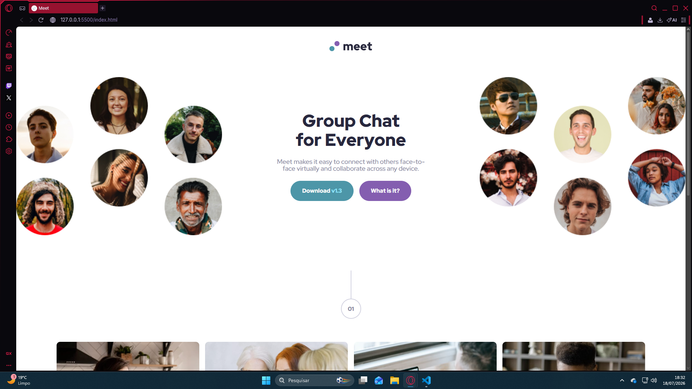

# Frontend Mentor - Meet landing page solution

This is a solution to the [Meet landing page challenge on Frontend Mentor](https://www.frontendmentor.io/challenges/meet-landing-page-rbTDS6OUR). Frontend Mentor challenges help you improve your coding skills by building realistic projects. 

## Table of contents

- [Overview](#overview)
  - [The challenge](#the-challenge)
  - [Screenshot](#screenshot)
  - [Links](#links)
- [My process](#my-process)
  - [Built with](#built-with)
  - [What I learned](#what-i-learned)
  - [Continued development](#continued-development)

## Overview

### The challenge

Users should be able to:

- View the optimal layout depending on their device's screen size
- See hover states for interactive elements

### Screenshot

### Links

- Solution URL: [https://github.com/henriquealfredobenettidesousa-blip/MEET-LANDING-PAGE]
- Live Site URL: [https://henriquealfredobenettidesousa-blip.github.io/MEET-LANDING-PAGE/]

## My process

### Built with

- Semantic HTML5 markup
- CSS custom properties
- Flexbox
- CSS Grid
- Mobile-first workflow

### What I learned

During this project, I improved my understanding of:

- Creating responsive layouts with Flexbox and CSS Grid
- Structuring pages with semantic HTML
- Organizing CSS for better readability
- Positioning decorative elements
- Building reusable layout patterns

### Continued development

For future projects, I want to continue improving:

- Accessibility (ARIA labels and screen reader support)
- HTML semantics
- CSS architecture and organization
- JavaScript to create interactive interfaces
